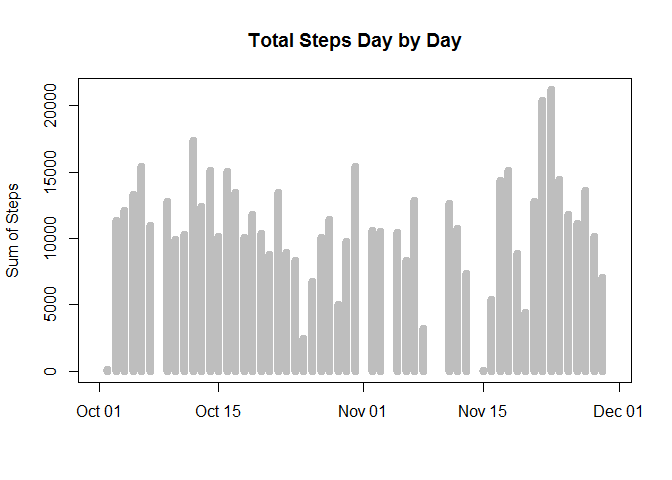

# Reproducible Research, Assignment 1
Alex  
December 11, 2016  


#**Reproducible Research Assignment 1**

============================================================================

##Part of the Data Science Specialization by [Johns Hopkins University](https://www.jhu.edu/) on [Coursera](https://www.coursera.org/)
###*Taught by  Roger D. Peng, Jeff Leek and Brian Caffo*

----------------------------------------------------------------------------------------------


```r
#Firstly, I will import the data set into R studio
setwd("C:/Users/Alex/Documents")

ds <- read.csv("C:/Users/Alex/Documents/activity.csv", header= TRUE, sep= ",", na.strings="NA")
```

```r
summary(ds)
```

```
##      steps                date          interval     
##  Min.   :  0.00   2012-10-01:  288   Min.   :   0.0  
##  1st Qu.:  0.00   2012-10-02:  288   1st Qu.: 588.8  
##  Median :  0.00   2012-10-03:  288   Median :1177.5  
##  Mean   : 37.38   2012-10-04:  288   Mean   :1177.5  
##  3rd Qu.: 12.00   2012-10-05:  288   3rd Qu.:1766.2  
##  Max.   :806.00   2012-10-06:  288   Max.   :2355.0  
##  NA's   :2304     (Other)   :15840
```

```r
str(ds)
```

```
## 'data.frame':	17568 obs. of  3 variables:
##  $ steps   : int  NA NA NA NA NA NA NA NA NA NA ...
##  $ date    : Factor w/ 61 levels "2012-10-01","2012-10-02",..: 1 1 1 1 1 1 1 1 1 1 ...
##  $ interval: int  0 5 10 15 20 25 30 35 40 45 ...
```


```r
#Next I use "aggregate"" to calculate the sum of steps for each day individually

PrepHist <- aggregate(ds$steps, by=list(date=ds$date), FUN=sum)

colnames(PrepHist)[2]<-"total_steps"

summary(PrepHist)
```

```
##          date     total_steps   
##  2012-10-01: 1   Min.   :   41  
##  2012-10-02: 1   1st Qu.: 8841  
##  2012-10-03: 1   Median :10765  
##  2012-10-04: 1   Mean   :10766  
##  2012-10-05: 1   3rd Qu.:13294  
##  2012-10-06: 1   Max.   :21194  
##  (Other)   :55   NA's   :8
```
By taking a quick look to PrepHist's values we can see some data entries which are too low for a day's total of steps
They could be possible outliers, data entry errors or even special occasions where the subject was not able to move (sickness,etc) or had the device turned off.


```r
#Then I will change the format of the "date" variable with as.Date()
PrepHist$date<- as.Date(PrepHist$date)
```


```r
#And now i will make the histogram of the steps
plot(PrepHist$date,PrepHist$total_steps, type="h",lwd=8, col="grey",xlab="", ylab ="Sum of Steps", main="Total Steps Day by Day")
```

<!-- -->

```r
PrepHist$total_steps <- as.numeric(PrepHist$total_steps)
```

```r
mean <- mean(PrepHist$total_steps,na.rm=T)
median <- median(PrepHist$total_steps,na.rm=T)
paste("The Mean is",mean)
```

```
## [1] "The Mean is 10766.1886792453"
```

```r
paste("The Median is",median)
```

```
## [1] "The Median is 10765"
```

After calculating the mean and the median we see that they are almost equal, which shows a tendency for normality.
<!-- -->

However, by observing the histogram we can safely assume that the distribution of total_steps doesn't resemble a normal distribution, given that the NA values are kept intact


```r
#Afterwards I check the average number steps in relation to the average 5-minute intervals, and make a time-series plot
AverageSteps <- aggregate(ds$steps, by=list(interval=ds$interval),FUN=mean,na.rm=T) 
# "na.rm=T" must be assigned in order to get the mean

colnames(AverageSteps)[2]<- "mean_steps"
```

```r
#A few info on the new table
head(AverageSteps)
```

```
##   interval mean_steps
## 1        0  1.7169811
## 2        5  0.3396226
## 3       10  0.1320755
## 4       15  0.1509434
## 5       20  0.0754717
## 6       25  2.0943396
```

```r
str(AverageSteps)
```

```
## 'data.frame':	288 obs. of  2 variables:
##  $ interval  : int  0 5 10 15 20 25 30 35 40 45 ...
##  $ mean_steps: num  1.717 0.3396 0.1321 0.1509 0.0755 ...
```

```r
summary(AverageSteps)
```

```
##     interval        mean_steps     
##  Min.   :   0.0   Min.   :  0.000  
##  1st Qu.: 588.8   1st Qu.:  2.486  
##  Median :1177.5   Median : 34.113  
##  Mean   :1177.5   Mean   : 37.383  
##  3rd Qu.:1766.2   3rd Qu.: 52.835  
##  Max.   :2355.0   Max.   :206.170
```


```r
plot(AverageSteps$interval, AverageSteps$mean_steps, type="l", col="red4", ylab="steps", xlab="5-minute interval", main="Average Number of Steps")
```

<!-- -->

```r
#Sorted the table in descending order so as to see highest value
sortedAS <- AverageSteps[order(-AverageSteps$mean_steps),]
head(sortedAS)
```

```
##     interval mean_steps
## 104      835   206.1698
## 105      840   195.9245
## 107      850   183.3962
## 106      845   179.5660
## 103      830   177.3019
## 101      820   171.1509
```
The maximum number of steps in average is located during the 835th minute which is around 02:00pm, assuming that we start at midnight. This is backed by the fact that the most of the activity takes place around that time.


```r
#I will first fill the missing values with the median
NAs<- sum(is.na(ds))
paste("Total number of missing values is",NAs)
```

```
## [1] "Total number of missing values is 2304"
```

```r
#At first I will turn the "steps" column to numeric class to avoid any problems
ds$steps <- as.numeric(ds$steps)
ds$steps[is.na(ds$steps)]= median(ds$steps, na.rm=T)

print(sum(is.na(ds))) #To confirm we no longer have NAs
```

```
## [1] 0
```

```r
PrepHist2 <- aggregate(ds$steps, by=list(date=ds$date), FUN=sum)
colnames(PrepHist2)[2]<-"total_steps"

PrepHist2$date<- as.Date(PrepHist2$date) #changing the class of "date" again

plot(PrepHist2$date,PrepHist2$total_steps, type="h",lwd=8, col="green3",xlab="", ylab ="Sum of Steps", main="Total Steps Day by Day")
```

<!-- -->

```r
mean2 <- mean(PrepHist2$total_steps,na.rm=T)
median2 <- median(PrepHist2$total_steps,na.rm=T)
paste("The Mean is",mean2)
```

```
## [1] "The Mean is 9354.22950819672"
```

```r
paste("The Median is",median2)
```

```
## [1] "The Median is 10395"
```

Next the histograms are put together for comparison

```r
par(mfrow=c(2,1))

plot(PrepHist$date,PrepHist$total_steps, type="h",lwd=8, col="grey",xlab="", ylab ="Sum of Steps", main="Total Steps Day by Day")

plot(PrepHist2$date,PrepHist2$total_steps, type="h",lwd=8, col="green4",xlab="", ylab ="Sum of Steps", main="Total Steps Day by Day(filled in)")
```

<!-- -->

The histograms are almost the same, but the mean is lower than the median, meaning that the distribution of total_steps when the missing values are filled in with the median tends to be right-skewed.
Which can be seen in the following histograms

```r
par(mfrow=c(1,2))

hist(PrepHist$total_steps,breaks=nrow(PrepHist), col="red4",xlab="Total Steps", main="Total Steps Distribution")
hist(PrepHist2$total_steps,breaks=nrow(PrepHist2), col="dodgerblue",xlab="Total Steps", main="Total Steps Distribution(filled in)")
```

<!-- -->


```r
#Next I fill in the missing values with the mean to see if there are any diffrencies to their filling in with the median
#The variable "steps" is already numeric
ds$steps[is.na(ds$steps)]= mean(ds$steps, na.rm=T)

print(sum(is.na(ds))) #To confirm we no longer have NAs
```

```
## [1] 0
```

```r
PrepHist3 <- aggregate(ds$steps, by=list(date=ds$date), FUN=sum)
colnames(PrepHist3)[2]<-"total_steps"

PrepHist3$date<- as.Date(PrepHist3$date) #changing the class of "date" again

plot(PrepHist3$date,PrepHist3$total_steps, type="h",lwd=8, col="green3",xlab="", ylab ="Sum of Steps", main="Total Steps Day by Day")
```

<!-- -->

```r
mean3 <- mean(PrepHist3$total_steps,na.rm=T)
median3 <- median(PrepHist3$total_steps,na.rm=T)
paste("The Mean is",mean3)
```

```
## [1] "The Mean is 9354.22950819672"
```

```r
paste("The Median is",median3)
```

```
## [1] "The Median is 10395"
```
As expected the differencies are next to none, since when we first calculated the mean and the median they were nearly equal 


```r
ds$steps <- as.numeric(ds$steps)

ds$steps[is.na(ds$steps)]= median(ds$steps, na.rm=T)

ds$date <- as.Date(ds$date)

days <- weekdays(ds$date)

ds<- cbind(ds,days) 

#Next I subset the data set in order to categorize the variables by weekdays and weekend
subset1 <- subset(ds, days=="Monday" | days=="Tuesday" | days=="Wednesday" | days=="Thursday" | days=="Friday", select=c(date,steps,interval))

subset2 <- subset(ds, days=="Saturday" | days=="Sunday", select=c(date,steps,interval))

#Modifying the data so that the missing values are filled in
WeekDays <- aggregate(subset1$steps, by=list(interval=subset1$interval),FUN=mean)

WeekEnd <- aggregate(subset2$steps, by=list(interval=subset2$interval),FUN=mean)

colnames(WeekDays)[2]<- "mean_steps"
colnames(WeekEnd)[2]<- "mean_steps"

#And finally making the plot. I chose to make it in 2 different plots instead of what is shown as an example

par(mfrow=c(1,2))

plot(WeekDays$interval,WeekDays$mean_steps, type="l", col="blue4",ylab="Steps",xlab="5-minute intervals",main = "Steps on WeekDays")
plot(WeekEnd$interval,WeekEnd$mean_steps, type="l", col="red",ylab = "",xlab = "5-minute intervals", main="Steps on WeekEnd" )
```

<!-- -->

It is clearly visible that the activity is higher during the weekend throughout the most of the day, in contrast to the weekdays' activity which as expected tends to be the same as the overall.
To conclude with, another note that should be made is that the peak of activity on weekdays is maintained during the weekend but there is a significant raise to the values of the latter in different times of the day

(General Info)

```r
sessionInfo()
```

```
## R version 3.3.2 (2016-10-31)
## Platform: x86_64-w64-mingw32/x64 (64-bit)
## Running under: Windows 7 x64 (build 7601) Service Pack 1
## 
## locale:
## [1] LC_COLLATE=English_United States.1252 
## [2] LC_CTYPE=English_United States.1252   
## [3] LC_MONETARY=English_United States.1252
## [4] LC_NUMERIC=C                          
## [5] LC_TIME=English_United States.1252    
## 
## attached base packages:
## [1] stats     graphics  grDevices utils     datasets  methods   base     
## 
## loaded via a namespace (and not attached):
##  [1] backports_1.0.4 magrittr_1.5    rprojroot_1.1   tools_3.3.2    
##  [5] htmltools_0.3.5 yaml_2.1.13     Rcpp_0.12.7     stringi_1.1.2  
##  [9] rmarkdown_1.2   knitr_1.15.1    stringr_1.1.0   digest_0.6.10  
## [13] evaluate_0.10
```
